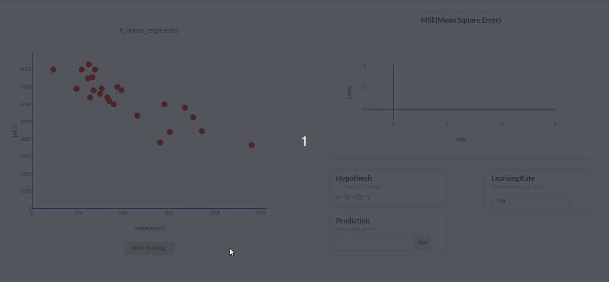

# ft_linear_regression
<kbd>

</kbd>

## Overview

`ft_linear_regression` is a 42 machine learning project to create a program that predicts the price of a car by
using a linear function train with a `gradient descent algorithm`. Dataset consists of a pair of price and mileage in `src/data.csv`. In this project we are free to use any language, so I used Javascript(NodeJS and React for visualization)

## How to use

1. Install package

   ```
   > npm i
   ```

2. Prediction before train
   Try to predict price before training our `src/model.json`

   ```
   > npm run predict
   > milage: 200000
   > price: 0
   ```

3. Train
   Try to predict price before training our `src/model.json`

   ```
   > npm run train
   ===========================
   Theta0 :  8008.400720135726
   Theta1 :  -0.02144848806185557
   ===========================
   ```

4. Prediction after train

   ```
   > npm run predict
   > milage: 200000
   > price: 3718.7031077646125
   ```

5. Visualization (React App localhost:8080)

   ```
   > npm run bonus
   ```
